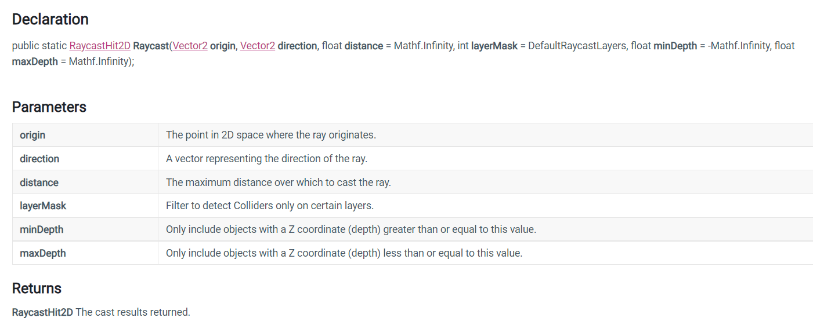

下面我们制作对话系统和音效。

<!--more-->

# 对话系统

## 对话条件的检测

角色要和青蛙对话，要求角色面朝青蛙并且距离在一定范围内，因此如果用一个Trigger来检测会不满足第一个条件，我们使用射线投射功能来进行检测，顾名思义，生成一条短直线来检测是否和青蛙碰撞。

在RubyController中的Update方法添加代码：

```C#
if (Input.GetKeyDown(KeyCode.X))
{
    RaycastHit2D hit = Physics2D.Raycast(rigidbody2d.position + Vector2.up * 0.2f, lookDirection, 1.5f, LayerMask.GetMask("NPC"));
    if (hit.collider != null)
    {
        Debug.Log("Raycast has hit the object " + hit.collider.gameObject);
    }
}
```

我们使用新的API，Physics2D.Raycast：



从位置origin，朝direction方向发射一个长度为distance的直线，在包含待检测碰撞体的图层layerMask中进行碰撞检测，还可以设置仅检测深度值在(minDepth，maxDepth)之间的对象，2D中深度值指的是Transform.position的Z轴坐标，用来进行图片的排序。

## 创建对话UI

和之前一样，我们选择青蛙给他添加一个Canvas子对象，然后将Render Mode设置为World Space，这样可以让UI不再以屏幕为标准，其大小和位置现在以世界坐标作为标准。然后修改Rect Transform中的值让画布调整到合适的大小。

注意，调整大小需要采用缩放的方式，因为UI以像素为单位，如果采用修改width和height的方法来实现，会导致UI仅有几个像素大小，无法显示内容。因此我们采用缩放来进行改变。

调整后为画布添加image子对象，锚点及位置对其四个顶点；将UIDialogueBox赋值给Image，然后再创建子对象UI- Text - TextMeshPro，添加后同样对齐四个点，输入想要显示的文字，就得到了对话框。

## 控制对话UI

我们要让对话框在检测到的时候显示，直接调用对话框组件的setActive方法即可，这个实际上就是Inspector窗口最上面的勾选。给NPC创建脚本并添加代码：

```C#
using System.Collections;
using System.Collections.Generic;
using UnityEngine;

public class NonPlayerDialog : MonoBehaviour
{
    public float displaytime;
    public GameObject dialogbox;
    private float timerDisplay;
    // Start is called before the first frame update
    void Start()
    {
        if (dialogbox != null)
        {
            dialogbox.SetActive(false);
        }
        timerDisplay = -1.0f;
    }

    // Update is called once per frame
    void Update()
    {
        if (timerDisplay >= 0)
        {
            timerDisplay -= Time.deltaTime;
            if (timerDisplay < 0)
            {
                if(dialogbox != null)
                {
                    dialogbox.SetActive(false);
                }
            }
        }
    }

    public void DisplayDialog()
    {
        timerDisplay = displaytime;
        dialogbox.SetActive(true);
    }
}

```

然后在刚才RubyController那里将输出改为调用这里最后一个方法即可。

# 音效系统

Unity中的音频系统具有Audio Listener和Audio Source两种类，前者接受音频，后者发出音频，从而模拟位置音效。其中，Audio Mixer可以混合多种音频，应用效果，执行母带制作；Audio Clip可以制作音频文件添加到Audio Source中。

## 背景音乐

我们先用最简单的方式添加背景音乐，在这个素材中所有的Audio Clip都制作好了，所以可以直接使用。那么要播放背景音乐，我们创建一个空的游戏对象，然后添加Audio Listener组件，将素材2D MUSIC LOOP赋值给组件的Audio Clip属性即可，然后勾选loop，设置Spatial Blend为3d。

## 交互的音效

某些需要在特定状态下播放的音效就只能通过代码控制了，我们现在用一个Audio Source组件控制播放不同的Audio Clip， 那就在角色对象上添加Audio Source组件，然后Start中获取，接着新声明一个方法接受类型为Audio Clip的参数并调用AudioSource.PlayOneShot方法播放这个Clip。

```C#
    public void Playsound(AudioClip audioClip)
    {
        audioSource.PlayOneShot(audioClip);
    }
```

然后将Clip作为其他游戏对象的属性，每当触发事件的时候就同时调用上面这个方法，即可播放声音。例如血瓶拾取的时候要播放音效，就让血瓶的音效作为血瓶的属性序列化出来，然后当血瓶判断可以加血的时候调用角色控制器来播放这个音频，就实现了播放效果，就和动画一样。

## 3D的声音

将Clip的Spatial Blend设置为3D即可，然后在Inspector下方有一个曲线，横轴代表距离，纵轴代表音量，拖动上面的点就可以设置衰减了。但是随意设置可能会导致挂在摄像机上的Listener听不到声音，因为摄像机和2D平面有一段距离，你的设置就可能超过这个距离。

解决方法是，删除主摄像机上的Audio Listener，然后在虚拟摄像机上创建一个子对象，查看虚拟摄像机的位置，观察到它的z轴坐标为-10，而子对象以父对象为原点，因此我们设置其坐标为(0,0,10)，这样一来子对象就是父对象在2D平面上的投影，那么在这个子对象上挂接Audio Listener即可，并且虚拟摄像机会随着角色移动，因此这个接收器就能模拟音效的3D效果了。

# 总结

到这里我们的2D案例就完成了，教程中并没有全部制作一遍，但是方法都已经使用过了，有时间的话可以进一步自己制作。但是这个项目仍然还是一个很简单的教程项目，缺乏完整的系统，例如菜单，地图，任务，战斗，装备等，都需要进一步学习。不过基本的操作流程我们学会了，基础移动，如何检测攻击，动画系统，音效系统，UI的使用，TileMap，相信在将来的学习中这些会更加熟悉，哪怕是在3D游戏中也是类似的。

因此现在可以体会到游戏制作中的难点了：

* 复杂的逻辑
* 资源的管理
* 素材的质量

* 设计的好坏

还有很多要素会影响，对于个人来说要做出好的实例，要尽可能有清晰的设计思路，并且素材是个很大的问题，通常来说3D的话动画资源可以白嫖Adobe[旗下的网站](https://www.mixamo.com/#/)，模型可以去模之屋下pmx格式的，不过要用Blender和插件处理pmx，导出Unity能用的格式Fbx。下一篇博客中就会详细说明这些工具的使用。

后面做一个ARPG项目demo，3D即时战斗游戏，Rougelike玩法，重点一是内容丰富，二是风格化美术效果。目前规划内容：

* 角色移动控制：层次状态机规划的移动动画播放，包括闪避动画，障碍物跨越等；
* 角色攻击系统：层次状态机规划角色的连招系统，技能系统；
* UI：尽量寻找风格化素材；
* 场景：地形编辑，多个场景转换控制，可交互场景物体；
* 敌人AI：决策行为树控制怪物的攻击，闪避，移动；
* 敌人控制系统：提供控制攻击、闪避、移动的效果，并管理死亡动画；

* 特效：怪物、角色、场景中的特效，同样只能使用免费资源；
* 着色器：风格化的渲染效果，尽量能展示技术难点，例如云雾渲染，流体渲染等；
