经过前面的学习你肯定大概了解如何制作游戏了，unity的基本内容我们都已经使用过，只是由于经验不足你很多时候难以想到某些问题解决方案，或者一些游戏内容的普遍做法，而且对于网络、服务器、内存管理等部分也一窍不通，不用担心，这些内容我们会在进阶部分时候进行学习。下面我们给自己的游戏创建一个游戏场景，你就了解怎么制作简单的单机游戏了。不过注意地形和场景是两回事，地形只包括地面上的山脉、起伏，而河流、房屋、植被等都要通过另外的资产或预制件制作完成。

<!--more-->

Unity自带的地形系统Terrain据说十分不方便，尤其在诸多开放世界游戏中需要制作精美的大地图，使用自带的系统肯定不能满足要求，感兴趣可以查看这篇[博客](https://gulu-dev.com/post/2014-11-16-open-world/)，简单来说就是使用平铺的Tile配合贴图完成。

所以我们这里对地形系统的使用主要还是入门为主，毕竟要制作一个风格统一的游戏需要优质的美术，需要的纹理等可以通过Assets Store搜索满足要求的场景配合我们前面一篇博客导入和渲染的模型。

# 准备工作

## 导入Terrain Tools

创建一个3D项目，在Packge Manager中找到Registry，搜索Terrain Tools，然后导入；导入完成后还要进一步下载提供的Sample包，提供了很多植被的预制件，地形纹理等素材。

如果搜索不到这个包，可以尝试两种办法：

* Project Settings/Package Manager，勾选Enable Preview Packages；
* 点击下图左上角加号，然后输入***com.unity.terrain-tools***即可；

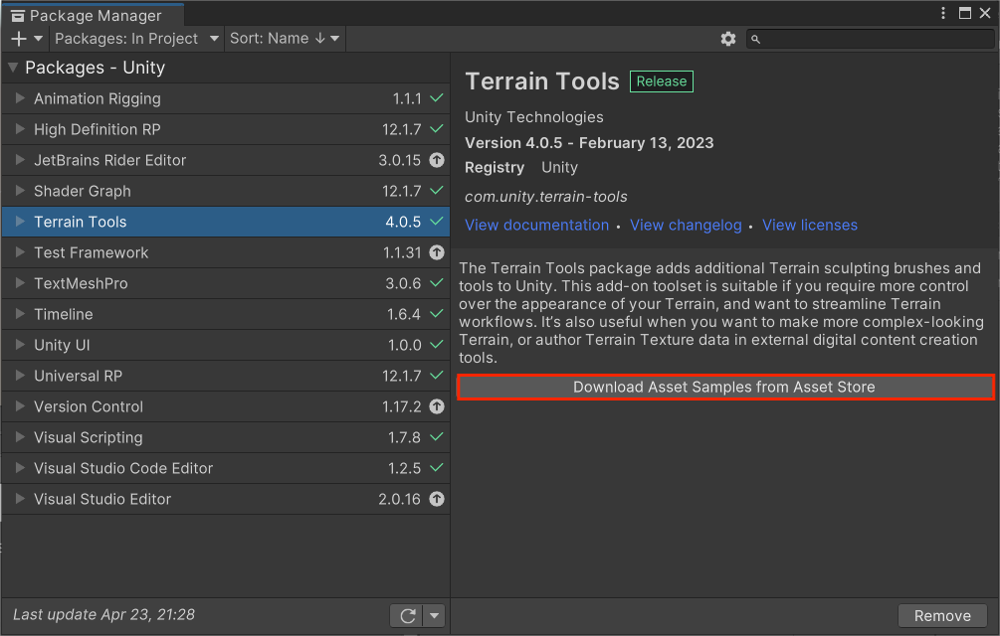

## 导入Fantasy Landscape

在Unity Assets Store中搜索并安装这个包，它提供了一个实例场景，以及多种预制件，方便我们制作地形。

## 修改URP管线

由于我们之前的角色使用的是URP进行渲染，这里我们也用URP来渲染场景，关于URP的介绍在另一个系列的博客中，这里仅记录如何升级一个项目为URP。

建立3D项目后，在Package Manager/Unity Registry中搜索Universal RP，安装，完成后在最外层文件夹中Create/Rendering/Universal Render Pipeline/Pipeline Asset(Forward Renderer)

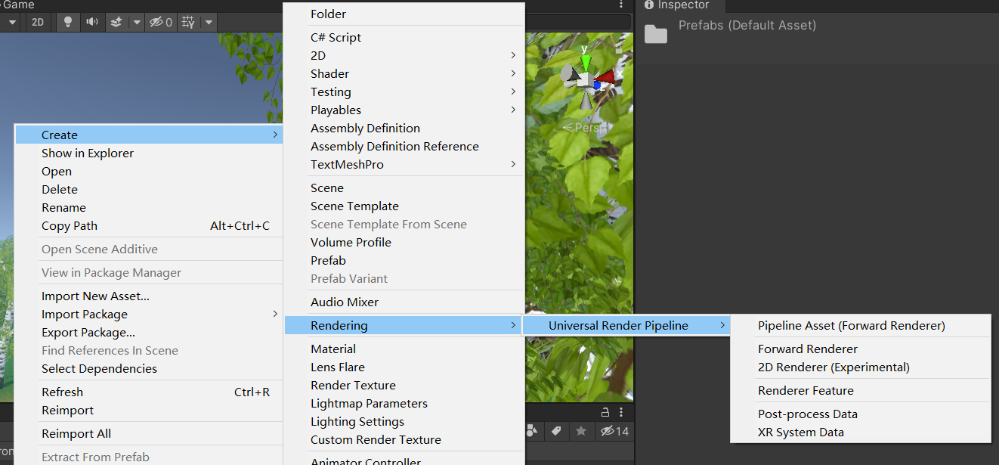

完成后会创建两个Assets，将第一个Assets命名为URP，打开Project Settings/Graphics，将第一项设置为这个资产：

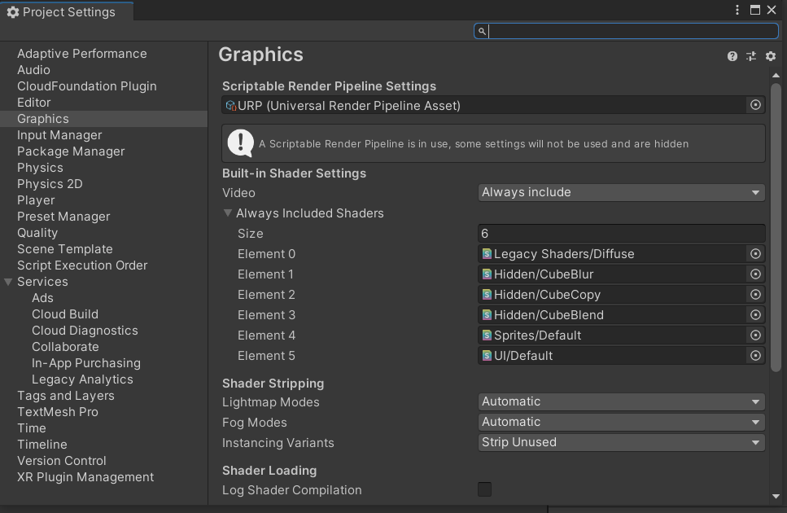

这里起始就是将默认的渲染管线替换成了URP，URP是可编程的渲染管线，就可以利用它编写Shader了。

导入后在Environments/Scenes中打开实例场景，你会发现场景中的树都变成粉色了，这是因为原本材质上的Shader不能被URP支持，此时我们需要升级材质：

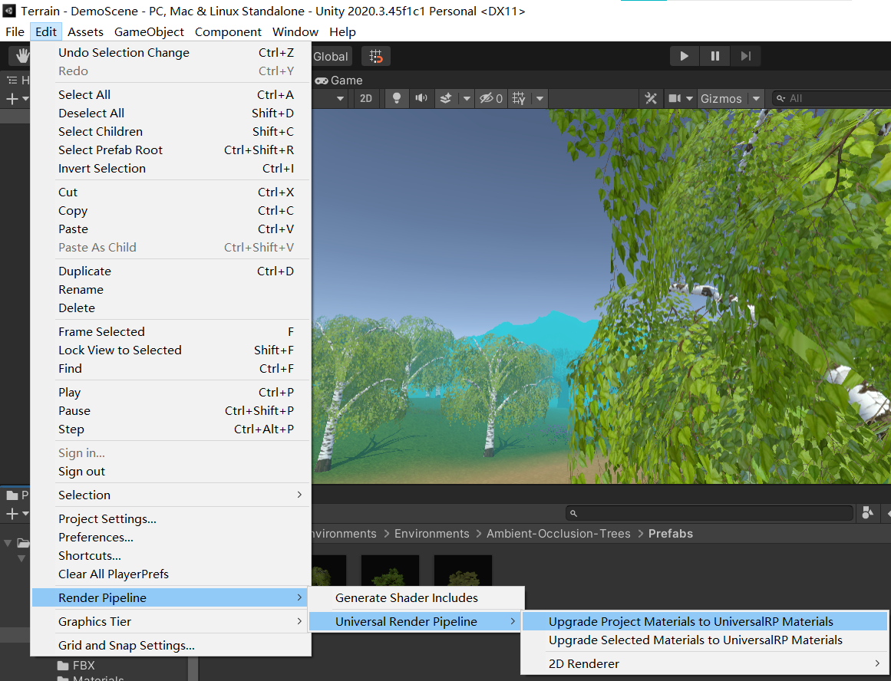

点击以后发现还是没有完全将材质转化过来，我们只能手动调整，进入Environments/Ambient-Occlusion-Trees/Materials文件夹，全选并修改Shader为Universal Render Pipeline/Simple Lit，这是一个通用的内置Shader，使用它可以正确在渲染管线中渲染我们的材质。

完成后打开Prefabs文件夹，接下来要对这四个树的预制件进行相同操作：

* 打开预制件；
* 修改树干Bark的材质为：
  * Surface Type：Opaque，不透明；
  * Render Face：Front，只渲染前面；
  * Base Map：同名纹理图片；
* 修改树叶Leaves的材质为：
  * Surface Type：Opaque，不透明；
  * Render Face：Both，两面都渲染；
  * Base Map：同名纹理图片；
  * Alpha Clipping：勾选后可控制透明度；

修改完成后，重新打开样例场景，这一次正确渲染了场景，我们可以开始学习了。

# 创建并修改地形

## 创建

打开Window/Terrain/Terrain Tools，第一栏可以创建基本地形，这里我们选择长宽500，高度为100，然后直接点击下方的Create即可创建。完成后看到层级栏中多出来一个拥有子对象的游戏对象TerrainGroup_0，它的子对象就是我们后续操作的目标。

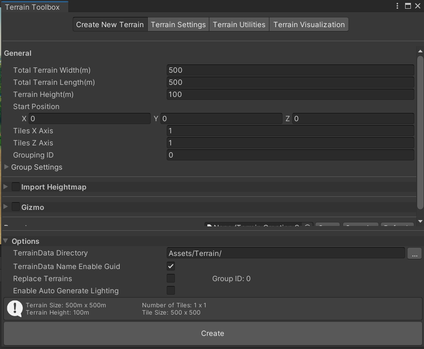

## 用Brush改变地形

创建之后我们先做一个起伏的地形，选中新建的子对象，看到有一个Terrain组件用于绘制地形，一个Terrain Collider用于进行碰撞检测，我们进入Terrain组件，选择第二个Paint Terrain，下面提供了非常多的绘制模式，我们介绍两种。

### Raise or Lower Terrain

最简单的绘制模式，这个刷子可以帮助我们快速调整地形。

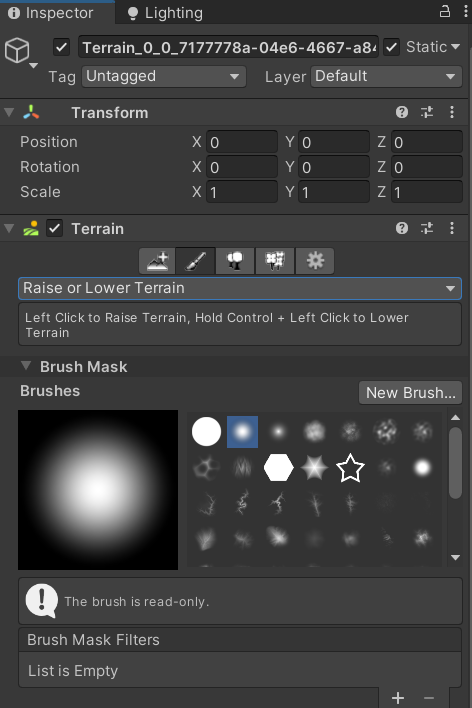

其中Brush Mask选项提供了很多不同的刷子，也就是我们刚才导入的包中提供的素材，不同的刷子绘制不同的效果，选中一个刷子后进入地图，操作快捷键如下：

* 左键，点击增高地形；
* A，按住后移动鼠标调整改变地形的力度；
* S，按住后移动鼠标调整刷子大小；
* D，按住后旋转刷子；
* LShift，按住后点击左键降低高度；

利用这些功能就可以方便地制作地形了。

### Sculpt/Noise

这个刷子采用噪声纹理的方式来修改地形，滚轮即可调整噪声大小，然后应用到地形上的方式和上面一样，不过这个就比较自然，刷子区域内会根据噪声来表现起伏。

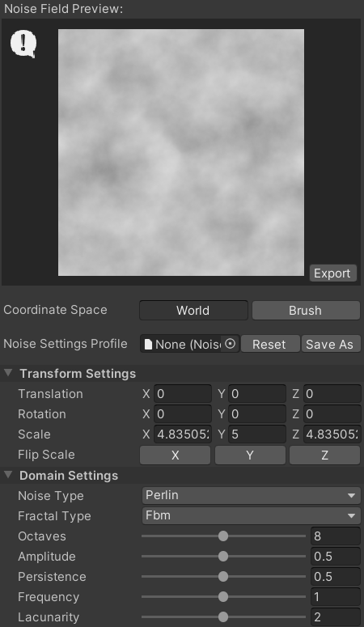

## 添加纹理和法线贴图

现在地形制作好了，需要给地形添加纹理，在Terrain中地形的纹理通过不同层来实现绘制，选择Paint Texture选项，创建新的层，选择草地和道路的纹理即可。

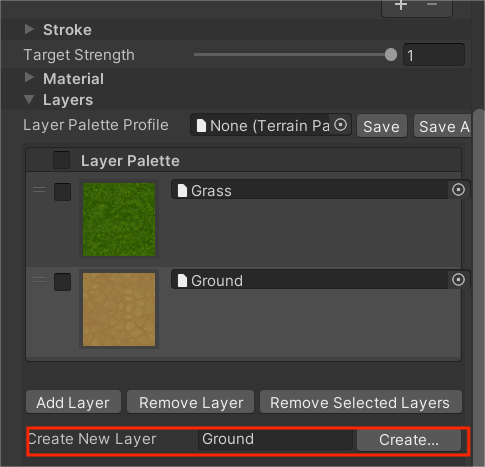

先添加草的纹理后，可以看到整个地图都覆盖了草的纹理，之后再添加地面的纹理，就可以使用刷子在草地上覆盖绘制了，现在制作一个简单的道路吧！

绘制后你可能发现道路的质量不高，像素化比较严重，这是因为我们使用的分辨率不够，所以回到Terrain Toolbox，修改Control Texture Resolution，并Apply to All。

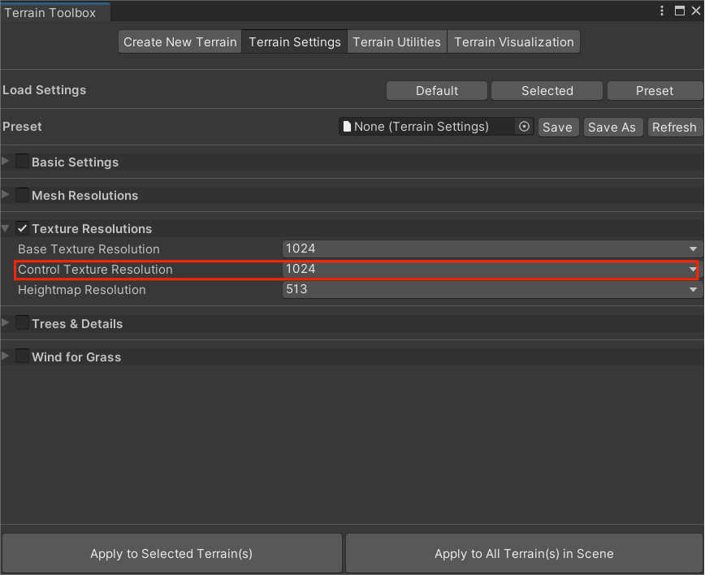

添加后可以转到我们使用的这两个纹理上，双击它们使用的Layer，这里还可以添加法线贴图，增强地图的凹凸感。

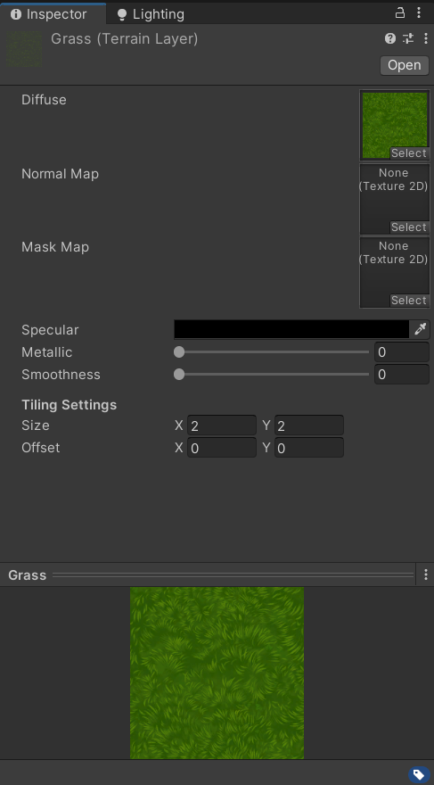

## 添加内嵌光照

这里简单介绍下，由于场景中比较暗，一个是Directional Light的强度不够，一个就是缺少内嵌光源，我们打开Window/Rendering/Lighting，选择Environment，点击最下面的Generate Lighting，具体原理在光照部分会详细介绍。

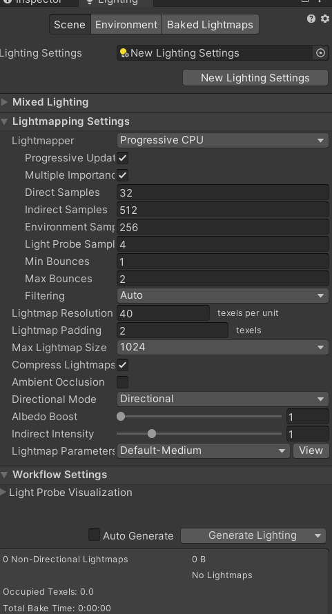

然后选中层级栏中的方向光，调整光线强度。

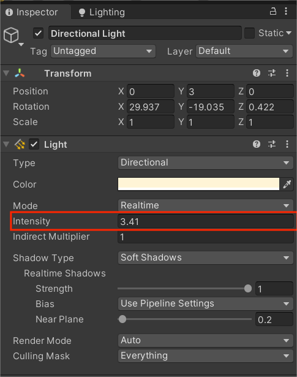

## 设置树

现在我们使用提供的四个预制件树木来丰富我们的场景。现在切换到Terrain组件的第三项，Paint Trees，点击Edit Trees/Add Tree，依次添加我们刚才修改过URP管线的四个树木，然后选中想要的树木，就可以用刷子添加了。

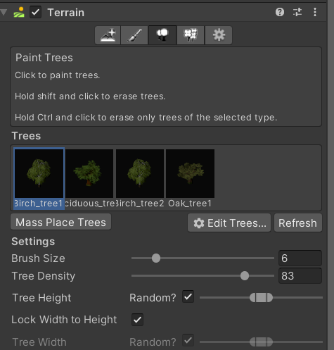

不过这种方法添加太慢了，我们直接使用Mass Place Trees按钮，将一次性随机添加指定数目的Trees到场景中，当然有一些树可能长在我们的道路上，可以按住Shift并点击来擦除不要的树。现在你可以制作完整的场景了。

添加了足够数量的树以后你会发现树的显示有些问题，在远处的树总是会显示一部分，并不会如我们平常见的游戏中那样消失或隐藏，这就需要制作LOD来调整了，Terrain是支持LOD(Level of Detail)的，但是我们这里为了简单使用就不采取这个办法，下面提供两种解决办法。

### 使用fog来遮挡

打开Lighting/Environment，勾选fog并调整雾气的颜色，以及雾效果的Density，这样可以用fog来遮盖远处的树木，并且耗费的计算量很小，只是效果可能不会特别好。

### 设置Billboard Start

转到Terrain组件的最后一项Terrain Settings，找到Tree & Detail Objects，修改Billboard Start的值，这个值和LOD有关，可以通过计算距离来渲染对应距离的模型等级，从而得到较好的效果。缺点则是需要消耗很多CPU计算量，不够这里我们可以暂时使用。

## 添加草、花

和前面添加树类似，我们打开Terrain的第四项，Paint Details，然后Edit Details，这里可以使用纹理来创建草的模型，也可使用制作好的Mesh(也就是预制件或者模型)，我们选择后者，然后添加Flower1和Grass1，调整刷子的尺寸、Target Strength等，然后在草地上绘制草花，添加更多细节。

你可能发现有些草由于地形起伏太倾斜了，这时可以使用Terrain Settings/Wind Settings for Grass的Bending属性，通过控制草对风的倾斜程度来改变草原本的倾斜程度。

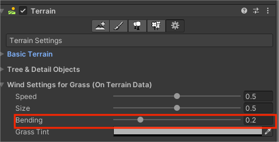

最后还可以找到预制件Rock1，直接拖进场景即可，这个由于我们不需要太多，所以可以手动，也可使用前面的方式添加。

## 设置天空盒

最后我们使用一个免费的天空盒素材，[Fantasy Sky Box Free](https://assetstore.unity.com/packages/2d/textures-materials/sky/fantasy-skybox-free-18353)，导入后转到Lighting/Environment，修改Sky Box Material即可：

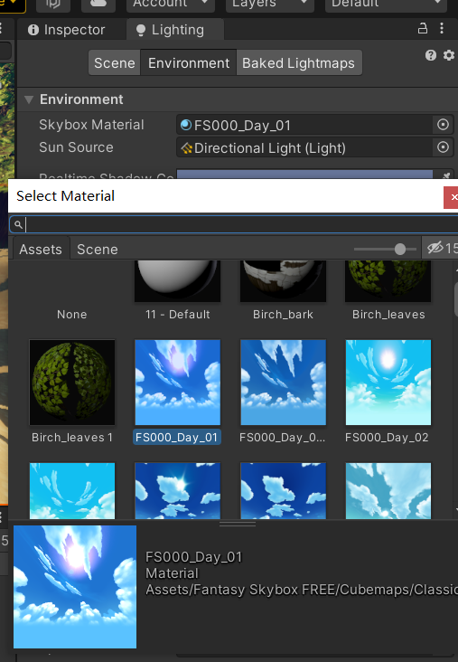

这样我们的场景就制作完成了。

之后通过添加光照、Global Volume可以实现很好的渲染效果，这里我们先不说明了，后面光照部分会主要介绍这些组件。我制作完成的场景如下：

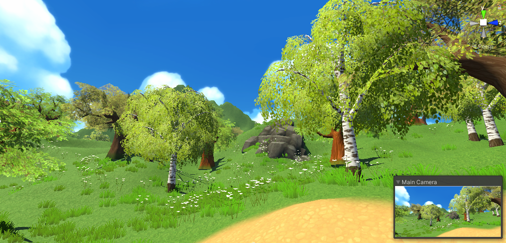

添加了Global Volume之后的效果：

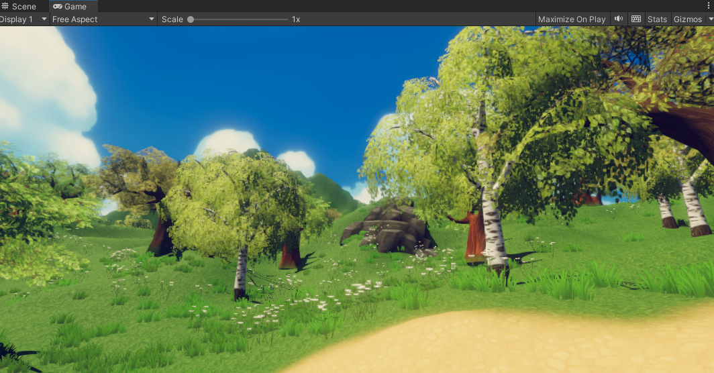

加上我们之前导入的模型，使用不同的Shader得到的效果：

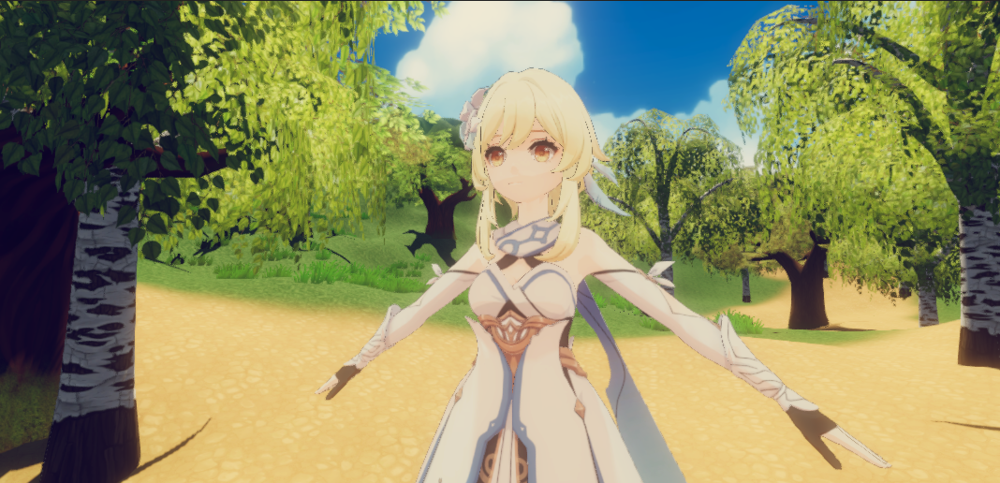

光照渲染这部分还是非常有趣的，不过难度也比较大，值得深入学习。

# 总结

到这里我们的Unity基础就算是完成了，包括场景切换，擎界面布局，脚本编写，刚体与碰撞，触发器和射线，UGUI，动画系统入门，以及这里介绍的地形系统，一般来说大规模的项目都有自己开发的地形编辑器，按照Terrain的思路可以想想大概是什么样子。而且我们这里的介绍肯定也不是面面俱到的，Terrain系统中的很多参数都可以自己尝试使用下，Unity中鼠标放上去也会给出解释，总之大概知道如何使用即可。

现在已经可以尝试用免费素材制作一个自己的3D游戏场景了。我们后面的博客重点介绍灯光，摄像机，动画系统和IK，还有场景之间的切换，最后总结下Unity的常用组件及其API，这个Unity入门系列就正式完结了，往后的Unity博客主要就是解决方案的分享，另外还有Unity Shader一个系列会加快更新，届时可能会再回过头来用这些基本操作。都完成后可能会更新非Unity的内容，热更、Lua之类的知识。
