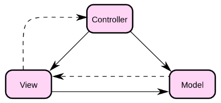

2023.10.19面经整理。

<!--more-->

## C#基础

### 面向对象三大特性

**继承**：重用现有代码，提高重用度。继承的传递性，继承的单根性（一个类只能有一个父类）。

**封装**：隐藏对象属性，实现细节方法，对外提供方法接口。

**多态**：同名方法根据不同环境表现不同的逻辑，静态多态重载，动态多态重写。

### 重载和重写

#### 静态多态

静态多态中，函数响应发生在编译阶段，C#提供两种方法实现该特性：

* 函数重载：参数不同，不能只有返回值不同。
* 运算符重载：

重载定义在一个类中，使用不同参数以调用。

#### 动态多态

动态多态中，函数响应发生在运行阶段，C#使用抽象类和虚方法实现。这里可能问到抽象类、虚方法和接口的区别。

访问public，使用abstract创建抽象类，抽象类包含抽象方法，抽象方法可以被派生类实现，使用override重写，没有方法体。但是抽象类无法被直接实例化，抽象类外部也不能声明抽象方法，不能用sealed声明抽象类。派生类必须使用override重写抽象属性和抽象方法，没有全部重写那么派生类就只能是抽象类。此外抽象方法声明不提供实现，因此没有方法体。

访问public，虚方法使用virtual声明，使用override重写，必须有方法体。虚方法在任意类中都可以实现，在子类中可以重写也可以不重写，不能用sealed修饰，否则不能重写。虚方法已经提供了函数实现，不过允许在子类中覆盖。C#中给类进行赋值时使用的是引用类型，也就是说不论是什么类的实例，=赋值其实是让这个符号引用被赋值的对象，实际运行的时候调用的也是被赋值对象的方法。更深入一点可以将这个分为编译时类型和运行时类，前面说的就是虚方法调用的是运行时类的方法，非虚方法调用的是编译时类的方法。

都不能使用其它的访问修饰符，protected也会因为不能访问其它文件而不方便。

总的来说，抽象方法是只有定义，没有函数体的抽象类函数，必须在子类中重写；虚方法是有方法体的函数，并且允许在子类中重写。

还有接口是一种特殊的抽象类，只包含常量和方法定义，没有实现，访问范围都是public，也需要实现全部接口。本来C#不支持多重继承，但是一个类可以继承多个接口。

### 值类型和引用类型

**值类型**：所有简单类型，int，float，bool，char，struct，enum，继承自System.ValueType，在结构中是堆栈分配的或内联分配的。

**引用类型**：string，object，class，interface，delegate，array，继承自System.Object，在结构中是堆分配的。

分配内存的时候值类型只需要一段内存，存放在栈中即可；而引用类型需要两段内存，一段和值类型一样存储实际数据，不过存放在堆中，第二段是存放在栈中的，记录数据在堆中的地址。当调用Console.WriteLine输出，显示的都是栈中的数据。

内存堆栈指内存中两个存储区（堆区，栈区）。栈内存不受我们和GC管理，这个托管堆受GC管理。

### .Net framework和.Net core，Mono，Xamarin的关系

.Net是跨语言，跨平台的语言平台，Common Language Runtime是.Net的关键，类似于Java的虚拟机。而.Net framework和.Net core都是.Net的实现，前者在windows上运行，后者windows、linux、iOS上都能运行。而Mono是当年只有.Net framework时为了在Linux上运行推出的，集成并实现了.NET的编译器、CLR和基础类库，后来被微软收购了，就开始弄.Net core。	

Xamarin是基于Mono的APP开发框架，弄好了安卓的可以转成ios，同样ios也可以转成安卓。

### 类的构造函数加static报错

静态构造函数不允许添加访问修饰符，且必须无参数。静态构造函数在实例化之前调用。

### 装箱和拆箱

装箱是将值类型转换为引用类型，分为三步：

* 在托管堆中为引用对象分配内存；
* 将值类型的数据复制到对应内存中，相当于使用副本，不会改变原来的值；
* 返回堆中地址存入栈中。

拆箱是将引用类型转换为值类型，分为两步：

* 获取托管堆中的地址；
* 将该地址的值拷贝到栈上。

### 数组(Array)、List、ArrayList区别

三者都是引用类型，数组在内存中是连续的，造成一些不方便，因此提供了ArrayList对象，能够动态扩充和收缩空间，不需要指定长度。

ArrayList将所有插入的数据作为object处理，如果有值类型的数据，需要装箱和拆箱，这些过程容易造成类型不匹配的问题，且消耗性能。于是推出了泛型List，和C++中的vector类似，提前指定其中的类型，不允许添加不同的类型。

### 结构体、类、接口

结构体是值类型，类和接口都是引用类型。

**【结构体和类的区别】**

1. **结构体是值类型，类是引用类型**
2. **结构体存在栈中，类存在堆中**
3. **结构体成员不能使用protected访问修饰符，而类可以**
4. **结构体成员变量申明不能指定初始值，而类可以**
5. **结构体不能申明无参的构造函数，而类可以**
6. **结构体申明有参构造函数后，无参构造不会被顶掉**
7. **结构体不能申明析构函数，而类可以**
8. **结构体不能被继承，而类可以**
9. **结构体需要在构造函数中初始化所有成员变量，而类随意**
10. **结构体不能被静态static修饰（不存在静态结构体），而类可以**

接口是指定一组函数成员而不给出实现的引用类型。可定义属性，但是要在派生类中实现该属性。可定义事件、方法、索引器。方法声明不能写范围修饰符，默认为public。利用接口可以实现多重继承。

### 闭包

闭包是指有权访问另一个函数作用域中变量的函数：

* 可以访问另一个函数局部变量；
* 该函数用完的局部变量不会随函数结束而销毁；

### string和stringBuider，stringBuffer

string声明字符串后，作为引用变量需要在栈内存储堆地址，堆内存储字符串内容，而且字符不可变，每次对这个字符进行改变就要更改栈中的引用地址，如果字符串不存在于堆中就得申请一个堆内存，舍弃原来的内容。包括拼接字符串和重新赋值也是，频繁修改会导致无效引用变多，频繁GC。例如拼接字符串"hello"world"，那么需要分配三次空间，两个单词各一次，然后拼接起来还要一次。

如果需要频繁变动字符串，那么就需要使用stringBuilder和stringBuffer，它们的内容可以多次修改，也不会产生新的对象。不过Builder不是线程安全的，Buffer是线程安全的。线程安全就是同时只有一个线程可以访问共享数据，防止不一致的问题。	

速度方面stringBuilder最快，适合单线程，然后是stringBuffer，适合多线程，最后才是string，常量字符串。

### static静态

static可以用来声明类、字段、属性和方法。用它声明的变量将静态执行，内存中只有一个，并且不用创建实例实行，直接使用类名就可以调用。

* 静态类内部只能是静态字段方法，没有其它实例，它本身也不能通过new关键字来实例化，本质上是一个密封的抽象类，不能作为基类。

* 静态变量只能是成员变量而不能是方法的局部变量，类初始加载时具有局部值。

* 静态方法只能访问静态变量和静态方法，通过类名直接调用。Main方法是程序唯一出入口，用的就是static修饰。
* 静态构造函数不能添加其它修饰符，且必须没有参数，只会被执行一次，在实例化之前自动执行，比实例化后调用的构造函数快。

### [GC](https://www.cnblogs.com/zblade/p/6445578.html)

垃圾回收机制，避免托管堆内存溢出，定期回收没有有效引用的内存对象。它由CLR实现，GC优化就是优化堆内存，减少堆内存，及时回收堆内存。

#### 堆内存分配和GC步骤

分配：

* 检查堆内存是否可以分配，如果足够就先分配；
* 内存不够，触发GC回收再检查分配；
* 还是不够，将扩展使用的内存，分配对应大小的空间；

需要减少第二和第三种情况发生的频率；

回收：

* 检查堆上的每个变量是否处于激活状态；
* 没激活的标记为可回收；
* 移除可回收变量，收回内存空间；

堆上的变量越多，GC检查就越多，耗费时间边长。

#### GC触发条件

* 按平台有不同的触发频率；
* 申请内存时空间不足需要GC；
* 可以主动强制GC；

#### GC可能带来的问题

* 堆内存碎片化：总的空间很大，但是连续的空间很小，难以找到合适的分配单元；这会导致游戏内存越来越大，GC越来越频繁；
* 游戏帧率下降：GC操作代价大，关键时候会使得游戏运行缓慢；

使用[profile window](https://unity3d.com/cn/learn/tutorials/topics/scripting/data-types)可以查看性能下降是不是由GC导致。

#### GC优化方法

我们可以通过三类方法优化GC：

* 减少GC次数；
* 减少单次GC检查的时间；
* 延迟GC时间，避免在关键时候触发；


对应到游戏中，我们可以使用这些具体手段：

* 定时强制GC，减少关键时候出事故的可能；

* 值类型变量使用后立即回收，引用型变量需要GC；
* 字符串拼接使用stringbuilder或者stringbuffer，而不是直接+=，字符串比较先定义变量存储；
* List和new的时候规定内存大小；
* 射线检测，使用避免GC的NoAlloc函数；
* foreach迭代器容易导致GC（目前Unity5.5已修复），使用For循环；
* 使用静态变量，GC不会回收存在的对象，但静态变量的引用对象可能被回收；
* 使用枚举替代字符串变量；
* 调用gameobject.tag=="XXX"就会新建字符串变量产生内存垃圾；那么采用GameObject.CompareTag()可以避免内存垃圾的产生：
* 不要在频繁调用的函数中反复进行堆内存分配，比如OnTriggerXXX，Update等函数；
* 在Update函数中，运行有规律的但不需要每一帧执行的代码，可以使用计时器，比如1秒执行一次某些代码。

### Lamda表达式

```
(a,b) => {return a+b;};

//只有一个参数可以省略成这样：
a => a*a;
```

### 常用容器类

* Stack：底层泛型数组实现，入栈动态扩容2倍；
* Queue：底层泛型数组实现，表头表尾指针，判空还是满通过size比较；
* Array：固定长度，类型不安全；
* ArrayList：动态数组，类型不安全；
* List：底层实现是泛型数组，动态扩容，类型安全；
* LinkedList：链表；
* HashTable哈希表（散列表）；
* Directionary：有序，泛型存储不需要进行类型装换（不需要装箱拆箱）

插入性能： LinkedList > Dictionary > HashTable > List
遍历性能：List > LinkedList > Dictionary > HashTable
删除性能： Dictionary > LinkedList > HashTable > List

在修改较频繁，且查找和删除也较多时，首选LinkedList,
在主要以删除为主，插入为辅，且查找较少时，首选Dictionary，
在查找频繁，而又无需修改的情况下，则首选List。

### 常规容器和泛型容器

常规容器有拆箱和装箱操作，速度慢，消耗性能，泛型容器效率更高。

### unsafe

unsafe 不安全代码，在不安全代码块中可以使用指针。

```C#
unsafe
{
    int number = 10;
    int* ptr = &number; // 声明一个指向整数的指针
    Console.WriteLine(*ptr); // 输出指针所指向的值
}
```

如果要指向堆中的托管对象，需要使用fixed，固定对象的地址防止GC回收。

```C#
unsafe
{
    int[] numbers = new int[5] { 1, 2, 3, 4, 5 };
    fixed (int* ptr = numbers)
    {
        // 使用指针ptr来访问数组中的元素
        Console.WriteLine(ptr[0]);
    }
}

```

可以在栈上或者堆上分配内存：

```C#
unsafe
{
    int stackAllocated = stackalloc int[100]; // 在栈上分配内存
    int* heapAllocated = (int*)malloc(sizeof(int) * 100); // 在堆上分配内存，需要手动释放
    // 使用 stackAllocated 和 heapAllocated 操作内存
    free(heapAllocated); // 释放堆上分配的内存
}

```

### ref和out

ref可以传递值类型变量的引用版本，类似指针，out也一样。唯一的区别是ref需要已经初始化过具体值，out可以使用没赋值过的变量作为参数传递。底层上看，out在方法内部分配一次地址，将这个地址给引用的变量使用，而ref将被引用变量的地址传递过来。

### for和foreach

for通过当前索引累加偏移量实现遍历，foreach主要通过指针偏移实现遍历，不过foreach要求对象实现了枚举接口，IEnumrable，而且会把对象的值复制到栈上面，效率比for低一些。

foreach操作时不能删除对象中的元素，因为使用的是副本会导致不一致性，程序会抛出异常，可以自行记录要删除的元素序号，结束迭代后再删除。

### 频繁创建一个对象，怎么减少开销？

需要初始化就对象池，不需要就单例模式一直用一份内存就行。

### 委托和事件

委托类似于一种函数指针，通过委托可以实现事件的订阅和发布；事件基于委托，将方法进行了封装，不能显示调用这些方法，提高了安全性。

### using的使用

用于资源管理和命名空间导入。

```C#
using (ResourceType resource = new ResourceType())
{
    // 使用资源
    // 资源会在这个块结束后自动被释放
}

using System; // 导入System命名空间

namespace ExampleNamespace
{
    class Program
    {
        static void Main(string[] args)
        {
            // 可以直接使用System命名空间中的类型，而不需要写成System.Console
            Console.WriteLine("Hello, World!");
        }
    }
}

```

### 泛型

定义时不指定具体的数据类型，在使用时再指定数据类型。

* 提高代码复用：处理基本数据类型时用泛型一次性完成；
* 类型安全：编译阶段提供类型安全检查，List和Dictionary都使用了泛型，确保不会出现类型不匹配的问题；
* 性能优化：避免了装箱和拆箱，因为类型相同不会发生值类型和引用类型的转换；

### 迭代器

迭代器可以遍历某个集合中的对象而不用关心其中对象的类型，C#中可迭代的对象需要继承IEnumrable接口，实现GetEnumrator方法，获得对象的迭代器，并且要求该迭代器继承IEnumrator接口，该接口提供MoveNext方法判断迭代是否继续，Reset方法重置迭代器，以及Current属性用于返回当前迭代器的值。此外IEnumrable和IEnumrator都有派生的泛型类。返回值为IEnumrable或者IEnumbrator的方法就是迭代器方法。

可迭代对象就能用foreach来访问，foreach依次调用可迭代对象的上述几个方法，就实现了简单的迭代函数。foreach(Type value in IEnumerable)会将value强转成Type，因此Type如果是非泛型可能造成类型不安全。

#### yield

为了进一步简化迭代器的使用，推出了yield关键字，用于迭代器方法内部。迭代器方法会自动生成一个迭代器，每个yield语句都表示一次暂停或中断，执行迭代器方法的时候程序会在yield return处暂停，并保存当前变量的值，下一次唤醒的时候回复变量，继续执行剩下的语句。yield break则会直接中断该方法，也就是让MoveNext方法返回false。

因此使用yield关键字之后就不用再自行继承IEnumrable和IEnumrator接口并实现，直接用foreach就可以完成对全部元素的迭代。

#### 延迟执行

C#的迭代器是延迟执行的，即只在需要的时候获取数据。实现方式就是yield return后保存当前状态，MoveNext判断是否继续，从而不会一次性申请很多空间来遍历整个集合。

## Unity脚本基础

### 协程

由于unity只能在主线程中获取对象的组件，所以一般不考虑多线程，而是采用协程来对任务进行分时并行处理。使用StartCoroutine来开启协程，依靠迭代器实现。

首先用IEnumrator来定义一个需要执行的迭代器方法，每一帧将调用迭代器的MoveNext方法，当返回值为false结束该协程。可以使用yield和其它返回值的组合如wait***等来实现延时操作。这些等待方法是Unity函数生命周期中的一部分，定期执行，方便控制什么时候唤醒这些协程。

应用：异步加载场景，字幕单个字符显示等。

### 函数生命周期


### 资源加载方式

Instantiate：实例化的方式直接加载出来；

Assetbundle：资源打包成AB包，然后用www模块get下来，从其中加载某个对象；可以分成不同patch，按需使用。

Resource.Load：直接load并返回某个类型的Object，前提是要把这个资源放在Resource命名的文件夹下，Unity不管有没有场景引用，都会将其全部打入到安装包中；这样会比较大。

### 移动物体的方式

* Transform：直接修改物体的位置；
* CharacterController：不受物理引擎影响，需要自己实现物理模拟；
* Rigidbody：AddForce、velocity等方式。

### 施加力的方式

需要rigidbody组件：

AddForce、AddForceAtPosition、ConstantForce等。

### 绕中心旋转和绕某点旋转

transform.Rotate和transform.RotateAround。

### 存储数据的方式

* ScriptableObject：在编辑器模式下可以实现数据持久化，自动序列化到属性面板中方便更改，但发布后数据不是持久化；

* PlayerPref：以键值对的形式将数据保存在文件中，跟动画状态机的赋值有点像，支持Int、Float、String的读取和保存，常用于用户设置，具备持久化；
* JSON：编写或者生成对应的实体类，如果有JSON的嵌套还要加一个Root类作为解析类，使用解析库例如newtonsoft来序列化和反序列化；
* XML：和JSON类似；
* 其它文件类型；

### LocalPosition和Position区别

LocalPosition相对于父对象的位置，Position是世界坐标系的位置。

### Mathf常用方法

* Mathf.Round(float f)：四舍五入；
* Mathf.Clamp(float value, float min, float max)：截断；
* Mathf.Lerp(float a, float b, float t)：插值；

### Animation组件常用方法

* Animation.CorssFade(string animation, float time = 0.3f);
* Animation.isPlaying(string name);

### 碰撞检测

需要两个物体都有Collider，其中一个拥有Rigidbody；或者一个拥有CharacterController，一个有Collider。用OnColliderEnter或者OnTriggerEnter方法。

### Destroy和DestroyImmediate

Destroy销毁消息对象，内存中还是存在，只有内存不够才被清除释放内存；DestroyImmediate立即销毁对象，并释放内存。

## Unity编辑器基础

### 动画原理

动画包含关键帧，记录顶点位移情况，中间通过插值得到流畅的动画效果。可以给一个物体创建Animation，添加关键帧让它根据动画自行运动起来。还可以给动画Clip添加事件，让动画播放到某一帧时回调动画事件。

### Avatar

为了实现动画复用提出了Avatar，通过骨骼名称进行匹配，让任意符合命名规范的模型骨骼同Unity的标准Avatar匹配，从而让动画能够通过映射的方法，运行在新的模型骨骼上面。

* Generic：普通模型，没有重定向功能；
* Humanoid：人型骨骼，可以重定向以进行动画复用；

Avatar Mask可以在多层的动画控制器中控制仅播放某个部位的动画，有利于减少美术资源要求。IK反向动力学通过反向计算运动情况来实现从手、脚部位置控制上级关节动画。

### Animation Layer

动画分层，不同层动画控制角色的多种状态。下层状态可以覆盖或同上层动画混合，达到某些效果，同时节省资源，例如持枪动画不需要行走持枪和静止持枪两份，让上半身体持枪即可。或者疲劳的时候使用混合，让角色在其它动画中摇摆身体展示疲劳的效果。

### 使用过的插件

* Magica Cloth：布料模拟的插件；
* Cinemachine：快速制作相机系统，支持相机切换、轨迹设置等；
* Animation Rigging：骨骼渲染和选中，还能添加一些位置约束；将骨骼摆放到正确位置上；
* Input System：输入系统，将按键和变量绑定并自动生成输入类给出监听的方法，调用监听方法可以轻松实现设备输入。

### 保持UGUI位置一致性

* 分辨率模式设置为Scale with screen size，画布会随分辨率进行缩放；
* UI位置通过设置锚点保持相对不变，UI位置会保持和锚点的相对距离；

### Prefab

是已经设置好的游戏对象，已经被序列化为二进制文件，可以方便地进行实例化。创建方法是将场景中的物体直接拖进Resource文件夹，再拖进属性面板或者直接用Resource.Load即可实例化。

### 组件上对象变成null是为什么

绑定的对象删除了，就没有引用了。

### 高速对象碰撞大体积物体

碰撞检测会失败，速度太快可能前后两帧里面都没有碰撞，把Collision Detection修改为Continuous Dynamic。包括角色动画也是，如果仅使用碰撞检测来触发是不行的。

此外还可以设计一个自己的方法来检测有没有碰撞到，例如用射线探测，用球体在某一帧探测等。

### MeshRender组件

* sharedMaterial：公共的材质，修改的是材质源文件；
* material：该对象自己的材质。

### CharacterController

继承自Collider，同时具有Rigidbody的一些属性，可以轻松设置角色的碰撞体、物理计算，使用CharacterController.Move。

### 光源类型

* Point：向四面八方发射光线；
* Direction：平行光；
* Spot：锥形聚光灯；

### 向量计算

叉乘、点乘、Normalized、Project。

## 性能优化

### level of detail

细节表现级别，根据距离动态变化，远离的时候丢失细节不影响表现效果，可以减少性能开销。

### Mipmap

对纹理进行了lod处理，原理是当纹理分辨率大于模型表面时，查询一个纹理值可能对应多个像素点，可以采用Mipmap对纹理区域进行平均，缩小纹理分辨率，既不会浪费多余的像素，也不会造成视觉上的错误效果。

### 内存泄漏

* 托管堆泄露：不安全代码块中申请后忘记释放。
* 资源内存泄漏：申请资源后忘记释放。
* 无效的堆内存：例如多此创建了字符串，导致内存碎片化。

## 设计模式

### 单例模式

保证一个类只有一个实例，提供能全局访问该实例的方法。类内部创建自己的静态实例，然后写一个静态方法返回该实例。

不会因为多次创建对象而导致冗余的变量副本，例如管理器脚本可以使用单例模式。

### 观察者模式

是一种行为设计模式，允许你定义一种订阅通知机制。分为下面几个角色：

* 发布者：事件发生后向订阅的对象发送消息。具体为一个委托或者事件。
* 观察者：监听该消息，发生事件时更新自己。将更新自己的方法添加到发布者的委托和事件中。

### MVC

Model-View-Controller，Model封装对底层数据的操作，View根据数据情况控制界面显示，Controller处理逻辑业务和交互，调用数据和视图更改的接口。



## 简历相关问题

### 自我介绍

面试官你好，我目前是本科大四的在校生，拟录取到软件学院，联系了梁老师想进入游戏开发的项目，明年9月份入学。我自己从今年四月份开始接触了游戏开发，用了四个月左右的事件学习Unity和Unity Shader，更早之前主要学的是图形学，了解基本的图形学原理。Unity这块lua和热更新还有网络编程暂时没有学习过，主要是写游戏逻辑做过自己的简单游戏demo，就是我简历里写的那个；Unity Shader是学过一些基本的图形学案例，了解语法。目前规划是继续学习，

### 项目中数据存储是怎么使用的

EXCEL转JSON文件的脚本，然后JSON的序列化和反序列化来持久化存储，主要是怪物的属性，任务状态，还有背包信息用了这个存储，暂时没有太多要配置的数据。

### 你用了两种设计模式介绍一下

观察者模式和单例模式，单例模式用在UI的管理器上面，用一个UI管理器保存了对其它UI的引用，方便获取并修改；观察者模式用在更新UI上面，发布者是角色和敌人的Controller，写了一个委托订阅者是UI管理器，血量改变时让管理器更新血条显示。攻击检测应该没用，攻击检测目前是直接拿过来调用，写的时候还没学到。

三层架构MVC，用来同步UI，Model负责数据更改，项目中其实就是json存储，View就是UI的管理器，提供更新UI的接口，剩下的几乎都是Controller，处理游戏逻辑。 

### 介绍一下你实现的系统

* 战斗：核心系统，本来想做成ACT，不过现在完成度还不够，做了3C(Character、Camera、Controll)，角色做了两种武器的各一套普通攻击，可以循环，然后有翻滚和奔跑，以及不同方向的受击。攻击检测使用的是动画事件，设置一个攻击区域检测在动画的某一帧是否有敌人，打到了就播放音效，调用敌人的受击接口，敌人的受击接口也会调UI管理器更新血条，同时播放受击动画和音效。怪物写了一个简单的AI，锁定玩家后根据距离行动，靠近就释放技能（对象池的计时器）或者普攻，远离了靠近玩家，距离适中就左右随机移动。
* 对话：txt存对话数据，协程让字符逐个显示填充到Text组件中，用一个变量标志当前迭代器方法是否执行完成，按下对话按键的时候开启协程，当角色远离了NPC或者播放完一句话后协程终止。
* 任务：EXCEL记录当前任务状态，根据任务状态来显示对话文字，UI还没制作。
* 副本：就是场景切换，走到一个位置后用LoadScene切换，不是异步加载。
* 摄像机：带碰撞的摄像机，原理是用输入系统获取鼠标的移动插值，左右移动就让相机沿着圆形轨道移动并旋转指向角色某个身体部位，上下移动也一样。碰撞检测从角色往摄像机位置发射一条长度为两者间距离的射线，如果射线碰到了地形，就将距离设置为从出发点到相交点距离的0.9倍，否则让相机保持距离。
* 背包系统：用Panel管理，将一个物品的UI显示格子创建成Prefab，Instantiate实例化添加到Panel的Grid中自动排列即可，json存储实现持久化。

### 现代渲染流水线（光栅化为例）

* CPU阶段（应用阶段）
  * 加载数据到显存中；
  * 设置渲染状态；
  * DrawCall调用；

* GPU阶段
  * 顶点数据传入
  * 几何阶段：顶点着色器、几何着色器、裁剪、屏幕映射；
  * 光栅化阶段：三角形组织，片元着色器，逐片元计算，得到屏幕像素。

### 光线追踪和路径追踪

以Whited-style光线追踪为例，从摄像机发射一束光线，打到物体上进行反射，如果能打到光源上，那么这个点就是可见的；如果没有到达光源，那么这个点不可见。

路径追踪可以看作优化的光线追踪，古典光线追踪仅仅反射一次，虽然解决了光栅化没有阴影的问题，但是光线只会在光滑表面上反射，忽略了漫反射，丢失了间接光照的细节。路径追踪发出很多条光线，通过渲染方程计算反射和折射光，反射光不再向一个方向反射，而是模拟真实物理情况，充分考虑了间接光照。

### 遇到过什么问题？

* 攻击输入：直接使用Trigger有问题，Animation系统的Trigger要求触发一次之后重置，但是这种游戏需要一直点鼠标，所以Trigger没等重置就触发了，这种情况需要对攻击输入进行限制，当角色攻击动画没结束时输入无效，否则会立即进入下一次攻击；同时要在两个时间重置Trigger，一个是Animation的OnStateEnter中，需要继承StateMachineBehaviour，一个是点击后重置或者让状态机不接受。
* 攻击检测：直接使用碰撞检测失效，没有勾选continuous Dynamic；后面用动画事件检测的。

### 举例说明UI怎么实现的

* 对话框：添加一个Panle，选一个背景图片，然后加一个文本框组件作为子对象，加一个Image作为人物头像展示即可。更新UI就只需要更新头像图片和文本内容。

## 数据结构和算法

### 寻路算法

广度优先、Dijkastra、启发式方法、A star算法。

## Lua和热更新

